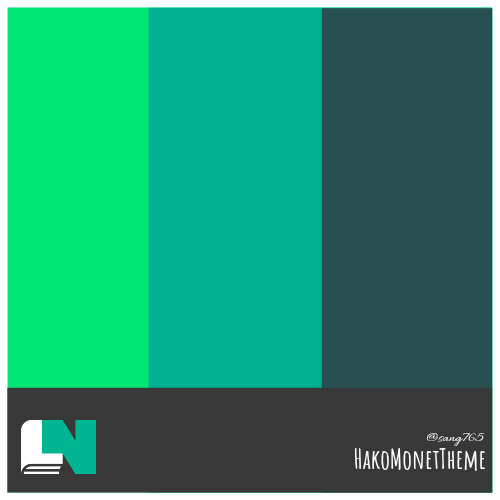

# Hako: Monet Theme

~~Material You theme dành cho Hako/DocLN.~~  
**KHÔNG CHỈ ĐƠN GIẢN LÀ MỘT THEME. NÓ CÒN HƠN THẾ NỮA!!!**

  

## 🌟 Tính năng 🌟

- 🎨 Tự động phân tích màu sắc từ ảnh bìa truyện
- 🎯 Áp dụng Material You color scheme động
- 📱 Giao diện responsive và hiện đại
- 🌙 Hỗ trợ dark mode (hoạt động tối ưu)
- ⚡ Tối ưu hóa trải nghiệm đọc truyện
- 🚫 Chặn quảng cáo popup (Ad Popup Blocker)
- 🔔 Tự động kiểm tra cập nhật
- 🏷️ Tag màu sắc theo thể loại
- ✨ Hiệu ứng animation mượt mà

## 🔒 Quyền riêng tư & Thu thập dữ liệu 🔒

- Script này hoạt động hoàn toàn trong trình duyệt của bạn và không gửi bất kỳ dữ liệu nào ra ngoài.
- Phân tích màu sắc từ ảnh bìa truyện được thực hiện cục bộ bằng Canvas API.
- Cài đặt người dùng được lưu trữ cục bộ thông qua GM_getValue (bộ nhớ của Tampermonkey/Violentmonkey).
- Cookie chỉ được sử dụng cho các tính năng cụ thể như ẩn cảnh báo tên miền và không chứa thông tin cá nhân.
- Không thu thập hoặc truyền tải bất kỳ thông tin cá nhân nào.

## 📦 Cài đặt 📦

### Bước 1: Cài đặt extension userscript
- [Tampermonkey](https://www.tampermonkey.net/) (Khuyến nghị)
- Hoặc [Violentmonkey](https://violentmonkey.github.io/get-it/) (Ưu tiên cho chromium từ phiên bản 138 trở lên)

> [!NOTE]  
> Nếu bạn sử dụng Tampermonkey `(Manifest V3)` trên **Chromium 138** trở lên. Bạn sẽ cần phải vào trang [extension](chrome://extensions) để bật developer mode sau vào chi tiết của Tampermonkey để cấp quyền "Cho phép sử dụng các tập tin thực thi" như vậy sẽ mất nhiều thời gian và **rất phức tạp** với những **người dùng cơ bản** nên Violentmonkey sẽ là giải pháp ưu tiên hơn cho Chromium 138.
>   
> 
> 
>   
> Chi tiết bạn có thể đọc [Tampermonkey FAQ #209](https://www.tampermonkey.net/faq.php?locale=en#Q209) nếu bạn biết Tiếng Anh.

### Bước 2: Cài đặt script
Nhấp vào [raw userscript](https://sang765.github.io/HakoMonetTheme/HakoMonetTheme.user.js) và nhấn "Install"  

### Bước 3: Cấp quyền cross-origin cho userscript
Khi vào bất kỳ trang web nào của Hako thì sẽ thông báo như ở dưới hình hiện lên. Hãy ấn "Always allow domain" và tận hưởng thành quả.  

## 🔄 Cập nhật 🔄

Script sẽ tự động kiểm tra cập nhật mỗi 30 phút. Bạn cũng có thể kiểm tra thủ công:

1. Mở Tampermonkey/Violentmonkey dashboard
2. Tìm script "Hako: Monet Theme"
3. Nhấn "Check for updates"

## 🐛 Báo cáo lỗi & Đề xuất 🐛

Nếu bạn gặp vấn đề hoặc có đề xuất cải tiến, vui lòng:
1. [Tạo issue mới](https://github.com/sang765/HakoMonetTheme/issues)
2. Mô tả chi tiết vấn đề hoặc ý tưởng của bạn
3. Kèm theo screenshot nếu có thể

## 📖 Hướng dẫn sử dụng 📖

### Với người dùng phổ thông:
- Chỉ cần vào trang web và tận hưởng thành quả. Nếu cần update màu theme chỉ cần mở script manager extension của bạn lên rồi click "Menu chính > Cài đặt".

### Với developer và phát triển repository:
- Vui lòng đọc:
  - [Hướng dẫn API chung](./docs/monet-api-guide.md)
  - [Hướng dẫn sử dụng MonetAPI v1](./docs/monet-api-v1-guide.md)
  - [Hướng dẫn sử dụng MonetAPI v2](./docs/monet-api-v2-guide.md)

## 🖼️ Screenshot 🖼️

### 📱 **Trên Mobile (Update lần cuối: 26/09/2025)** 📱

| | | |
|:---:|:---:|:---:|
|  |  |  | 
| **Preview Novel 1 (18+)** | **Peview Novel 2** | **Peview Novel 3** | 
|  |  |  |
| **Preview Novel 3-1** | **Peview Novel 3-2** | **Peview Novel 3-3** | 
|  |  |  |
| **Preview Menu** | **Peview Thông Báo** | **Peview Menu Account** | 

### 💻 **Trên Desktop** 💻

| | | |
|:---:|:---:|:---:|
|  |  |  |
| **Preview Trang Chủ** | **Peview Trang Thông Tin Truyện** | **Trang Thông Tin Truyện - GIF** | 
|  |  | |
| **Preview Cài Đặt Userscript** | **Peview Chặn Banner** | | 

## 🔧 Technical Details 🔧

- Sử dụng Canvas API để phân tích màu sắc ảnh
- **MonetAPI v2.0-Integrated**: Hệ thống quản lý màu sắc nâng cao với caching và accessibility
- Material You color scheme algorithm với V1/V2 compatibility
- **Ad Popup Blocker**: Chặn quảng cáo popup, bảo vệ Google/Facebook Login
- **Color Harmony & Accessibility**: Phân tích và tạo color schemes tương hợp
- **Theme Detection**: Tự động phát hiện dark/light mode
- Modular architecture dễ bảo trì và mở rộng

## ❓ Hỏi đáp thường gặp ("mà không ai hỏi :)))") ❓

### 1. Script này có an toàn không?
- Có, script này chỉ thay đổi giao diện người dùng và không thu thập dữ liệu cá nhân. Và source code ở đây thì bạn lo lắng gì nữa đúng không?

### 2. Làm thế nào để báo cáo lỗi?
- Bạn có thể tạo một issue mới trên GitHub và mô tả chi tiết về lỗi bạn gặp phải.

### 3. Script có hỗ trợ nhiều ngôn ngữ không?
- Hiện tại, script chỉ hỗ trợ tiếng Việt. Nói thẳng ra là thằng chủ repository nó bị ngu nên không biết viết multilanguage :v

### 4. Tôi có thể tùy chỉnh màu sắc không?
- Màu sắc được tự động phân tích từ ảnh bìa truyện, tuy nhiên bạn có thể điều chỉnh một số cài đặt trong phần "Cài đặt Userscript".

### 5. Script có hoạt động trên tất cả các trình duyệt không?
- Script được thiết kế để hoạt động trên các trình duyệt hỗ trợ Tampermonkey hoặc Violentmonkey.

### 6. Tôi có thể sử dụng script này trên điện thoại không?
- Có, script hoạt động trên cả trình duyệt di động hỗ trợ extension để cài đặt script manager.

### 7. Vậy trình duyệt nào hỗ trợ extension trên điện thoại?
- Hmm... Android bên chromium thì có Kiwi Browser, Yandex Browser, v.v... Còn iOS thì có iCab Mobile, Aloha Browser, v.v...

### 8. Làm thế nào để tắt script nếu tôi không muốn sử dụng nữa?
- Bạn có thể tắt hoặc gỡ bỏ script thông qua dashboard của Tampermonkey/Violentmonkey.

## 📜 License 📜

MIT License - xem file [LICENSE](LICENSE) để biết thêm chi tiết.

## 🙏 Ghi nhận 🙏

Cảm ơn các contributors và cộng đồng đã đóng góp ý tưởng và báo cáo lỗi để cải thiện script này.  

---

**Lưu ý**: Script này không chính thức liên kết với Hako/DocLN và được phát triển độc lập bởi cộng đồng.

